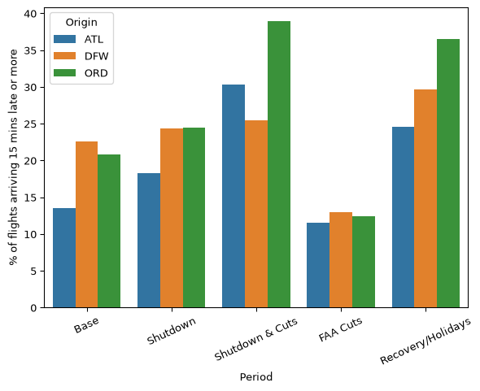
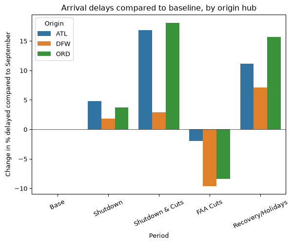
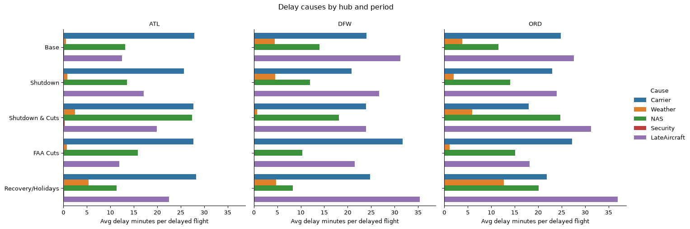
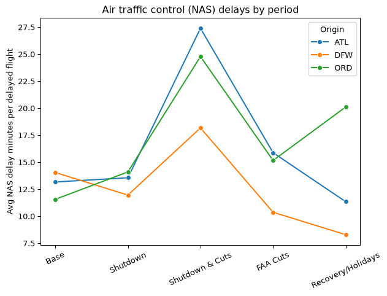
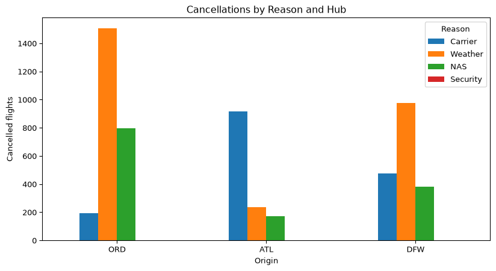
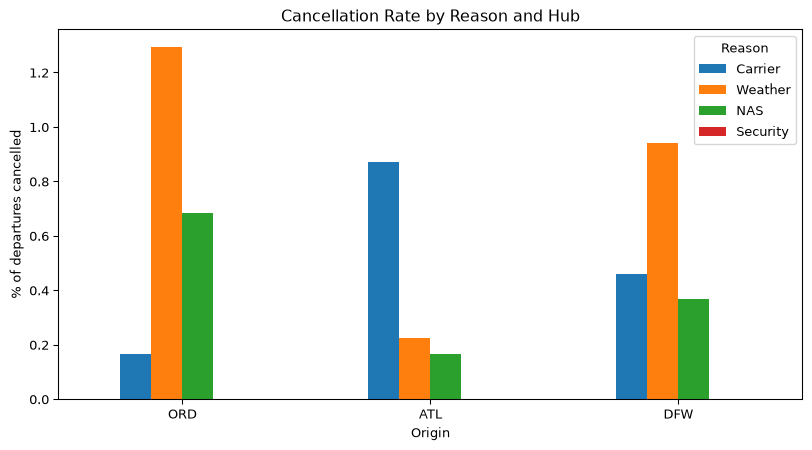
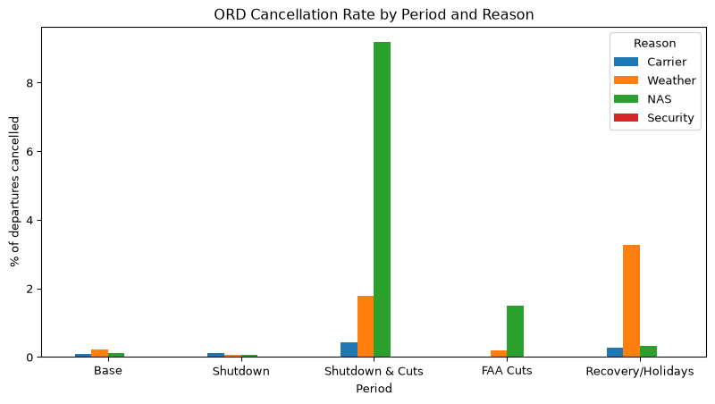
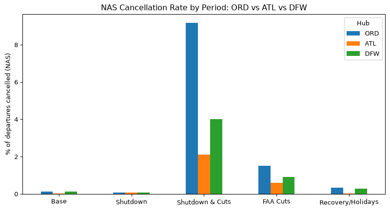

# US Domestic Flight Delays: September to December 2025


# Background

The 2025 federal government shutdown ran from October 1 to November 12.
It was the longest in US history. During this time air traffic
controllers worked without pay throughout. The FAA ordered airlines to
cut flights at 40 major US airports from November 7 until the order was
lifted on November 17.

# 3 Airports of Interest

Chicago O’Hare (ORD) Atlanta (ATL) Dallas-Fort Worth (DFW)

According to Paul Hartley, in his article about which U.S. airports were
hit hardest by the mass flight cancellations during the government
shutdown. Link:
https://simpleflying.com/examined-which-airports-hardest-hit-mass-cancellations-shutdown/

# The Data

The data reflects all domestic flights within the US for the
September–December 2025 period. This covers a normal month before the
shutdown, the shutdown itself, the FAA-mandated cuts and the holiday
recovery.

# The Data Source

The dataset was found on Kaggle and sourced from the official US Bureau
of Transportation Statistics (BTS) Reporting Carrier On-Time Performance
Database.

# Take note

Cancellation Code gives cancelation reason.  
A = carrier, B = weather, C = NAS, D = security. Empty if not cancelled.

NAS stands for National Airspace System. Thus a flight is cancelled
because of the System.

Diverted: 1 if the flight was diverted to another airport, otherwise 0.

# Load Libraries

``` python
import pandas as pd
import matplotlib.pyplot as plt
import seaborn as sns
```

# Import the Data

``` python
sep = pd.read_csv("~/Documents/MSBAAcademics/Fall_Mod1/DataWrangling/FinalProject/Data/flight_delays_2025_09.csv")

oct = pd.read_csv("~/Documents/MSBAAcademics/Fall_Mod1/DataWrangling/FinalProject/Data/flight_delays_2025_10.csv")

nov = pd.read_csv("~/Documents/MSBAAcademics/Fall_Mod1/DataWrangling/FinalProject/Data/flight_delays_2025_11.csv")

dec = pd.read_csv("~/Documents/MSBAAcademics/Fall_Mod1/DataWrangling/FinalProject/Data/flight_delays_2025_12.csv")
```

# Initial Exploration

To explore the dfs with forloops - add them to a dictionary

``` python
dfs = {"September": sep, "October": oct, "November": nov, "December": dec}
```

Check the shape of all 4 dataframes?

``` python
for i, df in dfs.items():
    print(f"{i}: {df.shape}")
```

    September: (562439, 40)
    October: (605844, 40)
    November: (570550, 40)
    December: (582304, 40)

Each dataframe has 40 columns

Print the column names of September

``` python
sep.columns.to_list()
```

    ['Year',
     'Quarter',
     'Month',
     'DayofMonth',
     'DayOfWeek',
     'FlightDate',
     'Reporting_Airline',
     'Flight_Number_Reporting_Airline',
     'Origin',
     'OriginCityName',
     'OriginState',
     'Dest',
     'DestCityName',
     'DestState',
     'CRSDepTime',
     'DepTime',
     'DepDelay',
     'DepDelayMinutes',
     'DepDel15',
     'TaxiOut',
     'WheelsOff',
     'WheelsOn',
     'TaxiIn',
     'CRSArrTime',
     'ArrTime',
     'ArrDelay',
     'ArrDelayMinutes',
     'ArrDel15',
     'Cancelled',
     'CancellationCode',
     'Diverted',
     'CRSElapsedTime',
     'ActualElapsedTime',
     'AirTime',
     'Distance',
     'CarrierDelay',
     'WeatherDelay',
     'NASDelay',
     'SecurityDelay',
     'LateAircraftDelay']

Do the column names match for each month? Use Sep as the reference.

``` python
ref_cols = list(dfs["September"].columns)

for i, df in dfs.items():
    print(i, list(df.columns) == ref_cols)
```

    September True
    October True
    November True
    December True

Do the data types match?

``` python
ref_types = list(dfs["September"].dtypes)

for i, df in dfs.items():
    print(i, list(df.dtypes) == ref_types)
```

    September True
    October True
    November True
    December True

# Join the Data: Stack on top

``` python
flights = pd.concat([sep, oct, nov, dec], ignore_index=True)

print(flights.shape)
```

    (2321137, 40)

Look at the head & tail of the data (but see all 40 columns)

``` python
with pd.option_context('display.max_columns', None): display(flights.head())
```

<div>
<style scoped>
    .dataframe tbody tr th:only-of-type {
        vertical-align: middle;
    }
&#10;    .dataframe tbody tr th {
        vertical-align: top;
    }
&#10;    .dataframe thead th {
        text-align: right;
    }
</style>

|  | Year | Quarter | Month | DayofMonth | DayOfWeek | FlightDate | Reporting_Airline | Flight_Number_Reporting_Airline | Origin | OriginCityName | OriginState | Dest | DestCityName | DestState | CRSDepTime | DepTime | DepDelay | DepDelayMinutes | DepDel15 | TaxiOut | WheelsOff | WheelsOn | TaxiIn | CRSArrTime | ArrTime | ArrDelay | ArrDelayMinutes | ArrDel15 | Cancelled | CancellationCode | Diverted | CRSElapsedTime | ActualElapsedTime | AirTime | Distance | CarrierDelay | WeatherDelay | NASDelay | SecurityDelay | LateAircraftDelay |
|----|----|----|----|----|----|----|----|----|----|----|----|----|----|----|----|----|----|----|----|----|----|----|----|----|----|----|----|----|----|----|----|----|----|----|----|----|----|----|----|----|
| 0 | 2025 | 3 | 9 | 6 | 6 | 2025-09-06 | MQ | 3447 | ORD | Chicago, IL | IL | CMH | Columbus, OH | OH | 1845 | 1843.0 | -2.0 | 0.0 | 0.0 | 24.0 | 1907.0 | 2055.0 | 11.0 | 2125 | 2106.0 | -19.0 | 0.0 | 0.0 | 0.0 | NaN | 0.0 | 100.0 | 83.0 | 48.0 | 296.0 | NaN | NaN | NaN | NaN | NaN |
| 1 | 2025 | 3 | 9 | 7 | 7 | 2025-09-07 | MQ | 3447 | ORD | Chicago, IL | IL | CMH | Columbus, OH | OH | 1939 | 2002.0 | 23.0 | 23.0 | 1.0 | 20.0 | 2022.0 | 2212.0 | 8.0 | 2213 | 2220.0 | 7.0 | 7.0 | 0.0 | 0.0 | NaN | 0.0 | 94.0 | 78.0 | 50.0 | 296.0 | NaN | NaN | NaN | NaN | NaN |
| 2 | 2025 | 3 | 9 | 8 | 1 | 2025-09-08 | MQ | 3447 | ORD | Chicago, IL | IL | CMH | Columbus, OH | OH | 1939 | 2031.0 | 52.0 | 52.0 | 1.0 | 23.0 | 2054.0 | 2241.0 | 7.0 | 2213 | 2248.0 | 35.0 | 35.0 | 1.0 | 0.0 | NaN | 0.0 | 94.0 | 77.0 | 47.0 | 296.0 | 35.0 | 0.0 | 0.0 | 0.0 | 0.0 |
| 3 | 2025 | 3 | 9 | 10 | 3 | 2025-09-10 | MQ | 3447 | ORD | Chicago, IL | IL | CMH | Columbus, OH | OH | 1939 | 1934.0 | -5.0 | 0.0 | 0.0 | 22.0 | 1956.0 | 2148.0 | 8.0 | 2213 | 2156.0 | -17.0 | 0.0 | 0.0 | 0.0 | NaN | 0.0 | 94.0 | 82.0 | 52.0 | 296.0 | NaN | NaN | NaN | NaN | NaN |
| 4 | 2025 | 3 | 9 | 11 | 4 | 2025-09-11 | MQ | 3447 | ORD | Chicago, IL | IL | CMH | Columbus, OH | OH | 1939 | 2013.0 | 34.0 | 34.0 | 1.0 | 22.0 | 2035.0 | 2236.0 | 5.0 | 2213 | 2241.0 | 28.0 | 28.0 | 1.0 | 0.0 | NaN | 0.0 | 94.0 | 88.0 | 61.0 | 296.0 | 9.0 | 0.0 | 0.0 | 0.0 | 19.0 |

</div>

``` python
with pd.option_context('display.max_columns', None): display(flights.tail())
```

<div>
<style scoped>
    .dataframe tbody tr th:only-of-type {
        vertical-align: middle;
    }
&#10;    .dataframe tbody tr th {
        vertical-align: top;
    }
&#10;    .dataframe thead th {
        text-align: right;
    }
</style>

|  | Year | Quarter | Month | DayofMonth | DayOfWeek | FlightDate | Reporting_Airline | Flight_Number_Reporting_Airline | Origin | OriginCityName | OriginState | Dest | DestCityName | DestState | CRSDepTime | DepTime | DepDelay | DepDelayMinutes | DepDel15 | TaxiOut | WheelsOff | WheelsOn | TaxiIn | CRSArrTime | ArrTime | ArrDelay | ArrDelayMinutes | ArrDel15 | Cancelled | CancellationCode | Diverted | CRSElapsedTime | ActualElapsedTime | AirTime | Distance | CarrierDelay | WeatherDelay | NASDelay | SecurityDelay | LateAircraftDelay |
|----|----|----|----|----|----|----|----|----|----|----|----|----|----|----|----|----|----|----|----|----|----|----|----|----|----|----|----|----|----|----|----|----|----|----|----|----|----|----|----|----|
| 2321132 | 2025 | 4 | 12 | 12 | 5 | 2025-12-12 | WN | 1393 | MDW | Chicago, IL | IL | MCO | Orlando, FL | FL | 650 | 649.0 | -1.0 | 0.0 | 0.0 | 25.0 | 714.0 | 1021.0 | 10.0 | 1025 | 1031.0 | 6.0 | 6.0 | 0.0 | 0.0 | NaN | 0.0 | 155.0 | 162.0 | 127.0 | 990.0 | NaN | NaN | NaN | NaN | NaN |
| 2321133 | 2025 | 4 | 12 | 12 | 5 | 2025-12-12 | WN | 2594 | MDW | Chicago, IL | IL | MCO | Orlando, FL | FL | 1710 | 1704.0 | -6.0 | 0.0 | 0.0 | 14.0 | 1718.0 | 2025.0 | 8.0 | 2045 | 2033.0 | -12.0 | 0.0 | 0.0 | 0.0 | NaN | 0.0 | 155.0 | 149.0 | 127.0 | 990.0 | NaN | NaN | NaN | NaN | NaN |
| 2321134 | 2025 | 4 | 12 | 12 | 5 | 2025-12-12 | WN | 2952 | MDW | Chicago, IL | IL | MCO | Orlando, FL | FL | 1135 | 1140.0 | 5.0 | 5.0 | 0.0 | 11.0 | 1151.0 | 1450.0 | 4.0 | 1510 | 1454.0 | -16.0 | 0.0 | 0.0 | 0.0 | NaN | 0.0 | 155.0 | 134.0 | 119.0 | 990.0 | NaN | NaN | NaN | NaN | NaN |
| 2321135 | 2025 | 4 | 12 | 12 | 5 | 2025-12-12 | WN | 3727 | MDW | Chicago, IL | IL | MCO | Orlando, FL | FL | 805 | 801.0 | -4.0 | 0.0 | 0.0 | 11.0 | 812.0 | 1112.0 | 15.0 | 1145 | 1127.0 | -18.0 | 0.0 | 0.0 | 0.0 | NaN | 0.0 | 160.0 | 146.0 | 120.0 | 990.0 | NaN | NaN | NaN | NaN | NaN |
| 2321136 | 2025 | 4 | 12 | 12 | 5 | 2025-12-12 | WN | 3732 | MDW | Chicago, IL | IL | MCO | Orlando, FL | FL | 1935 | 1951.0 | 16.0 | 16.0 | 1.0 | 11.0 | 2002.0 | 2304.0 | 7.0 | 2310 | 2311.0 | 1.0 | 1.0 | 0.0 | 0.0 | NaN | 0.0 | 155.0 | 140.0 | 122.0 | 990.0 | NaN | NaN | NaN | NaN | NaN |

</div>

``` python
flights.info()
```

    <class 'pandas.DataFrame'>
    RangeIndex: 2321137 entries, 0 to 2321136
    Data columns (total 40 columns):
     #   Column                           Dtype  
    ---  ------                           -----  
     0   Year                             int64  
     1   Quarter                          int64  
     2   Month                            int64  
     3   DayofMonth                       int64  
     4   DayOfWeek                        int64  
     5   FlightDate                       str    
     6   Reporting_Airline                str    
     7   Flight_Number_Reporting_Airline  int64  
     8   Origin                           str    
     9   OriginCityName                   str    
     10  OriginState                      str    
     11  Dest                             str    
     12  DestCityName                     str    
     13  DestState                        str    
     14  CRSDepTime                       int64  
     15  DepTime                          float64
     16  DepDelay                         float64
     17  DepDelayMinutes                  float64
     18  DepDel15                         float64
     19  TaxiOut                          float64
     20  WheelsOff                        float64
     21  WheelsOn                         float64
     22  TaxiIn                           float64
     23  CRSArrTime                       int64  
     24  ArrTime                          float64
     25  ArrDelay                         float64
     26  ArrDelayMinutes                  float64
     27  ArrDel15                         float64
     28  Cancelled                        float64
     29  CancellationCode                 str    
     30  Diverted                         float64
     31  CRSElapsedTime                   float64
     32  ActualElapsedTime                float64
     33  AirTime                          float64
     34  Distance                         float64
     35  CarrierDelay                     float64
     36  WeatherDelay                     float64
     37  NASDelay                         float64
     38  SecurityDelay                    float64
     39  LateAircraftDelay                float64
    dtypes: float64(23), int64(8), str(9)
    memory usage: 815.3 MB

Look at the missing values

``` python
flights.isna().sum().sort_values(ascending=False)
```

    CancellationCode                   2291851
    LateAircraftDelay                  1838744
    SecurityDelay                      1838744
    NASDelay                           1838744
    WeatherDelay                       1838744
    CarrierDelay                       1838744
    AirTime                              34019
    ActualElapsedTime                    34019
    ArrDel15                             34019
    ArrDelayMinutes                      34019
    ArrDelay                             34019
    ArrTime                              29738
    TaxiIn                               29738
    WheelsOn                             29738
    TaxiOut                              29099
    WheelsOff                            29099
    DepDelay                             28368
    DepDel15                             28368
    DepDelayMinutes                      28368
    DepTime                              28256
    Diverted                                 0
    Month                                    0
    DayofMonth                               0
    DayOfWeek                                0
    FlightDate                               0
    Distance                                 0
    Reporting_Airline                        0
    Flight_Number_Reporting_Airline          0
    CRSElapsedTime                           0
    Cancelled                                0
    Origin                                   0
    OriginCityName                           0
    OriginState                              0
    Dest                                     0
    DestCityName                             0
    CRSArrTime                               0
    DestState                                0
    CRSDepTime                               0
    Quarter                                  0
    Year                                     0
    dtype: int64

This looks reasonable - the reason for the high number of missing values
with Cancellation Code is that most flights in this data weren’t
cancelled.

# Creating periods

Base period: 1 - 30 Sep Shutdown: 1 Oct - 6 Nov Sutdown & cuts: 7 - 12
Nov FAA cuts: 13 - 17 Nov Recovery/ Holidays: 18 Nov - 31 Dec

Some things to note: on Nov 15 the madatory flight cut was reduced from
6% to 3%. And the order was lifted Nov 17.

``` python
bins = pd.to_datetime(["2025-09-01", "2025-10-01", "2025-11-07",
                       "2025-11-13", "2025-11-18", "2026-01-01"]) # each day is the 1st day of the period, with the last period including 31 Dec
labels = ["Base", "Shutdown", "Shutdown & Cuts",
          "FAA Cuts", "Recovery/Holidays"]

flights["Period"] = pd.cut(flights["FlightDate"], bins=bins,
                           labels=labels, right=False) 
                           # .cut: bins continuous numerical data into discrete intervals
                           # right = FALSE: a period begins on its own edge and stops the day before the next

flights["Period"].value_counts(sort=False)
```

    Period
    Base                 562439
    Shutdown             717182
    Shutdown & Cuts      112913
    FAA Cuts              97418
    Recovery/Holidays    831185
    Name: count, dtype: int64

# 3 Airports of interest

Copy the data for our 3 airports

``` python
hubs = ["ORD", "ATL", "DFW"]
```

DF where hubs are the origin

``` python
hub_origin = flights[flights["Origin"].isin(hubs)].copy()
```

DF where hubs are the destination

``` python
hub_dest = flights[flights["Dest"].isin(hubs)].copy()
```

# What happened with Arrival Delays across periods, if the origin was a hub?

Use rates/ percentages as the period lenghts differ.

Summarise arrival delays by hub & period

``` python
arr_origin = (
    hub_origin
    .groupby(["Origin", "Period"], observed=True, as_index=False) #only show the combinations that actually exist in the data & kept as regular columns
    .agg(
        flights=("ArrDelayMinutes", "size"), # nr of flights
        pct_delayed15=("ArrDel15", "mean"), # % of flights arriving 15+ min late
        avg_delay=("ArrDelayMinutes", "mean"), # avg minutes late (early = 0)
        median_delay=("ArrDelayMinutes", "median"),
    )
    .assign(pct_delayed15=lambda x: (x["pct_delayed15"] * 100).round(1)) # makes decimals -> percentage
)

arr_origin
```

<div>
<style scoped>
    .dataframe tbody tr th:only-of-type {
        vertical-align: middle;
    }
&#10;    .dataframe tbody tr th {
        vertical-align: top;
    }
&#10;    .dataframe thead th {
        text-align: right;
    }
</style>

|     | Origin | Period            | flights | pct_delayed15 | avg_delay | median_delay |
|-----|--------|-------------------|---------|---------------|-----------|--------------|
| 0   | ATL    | Base              | 25839   | 13.5          | 8.242849  | 0.0          |
| 1   | ATL    | Shutdown          | 32460   | 18.3          | 11.607593 | 0.0          |
| 2   | ATL    | Shutdown & Cuts   | 5205    | 30.3          | 24.577558 | 0.0          |
| 3   | ATL    | FAA Cuts          | 4560    | 11.5          | 7.307795  | 0.0          |
| 4   | ATL    | Recovery/Holidays | 36983   | 24.6          | 17.734627 | 0.0          |
| 5   | DFW    | Base              | 25641   | 22.6          | 17.558176 | 0.0          |
| 6   | DFW    | Shutdown          | 32225   | 24.4          | 16.643252 | 0.0          |
| 7   | DFW    | Shutdown & Cuts   | 4855    | 25.5          | 17.995219 | 0.0          |
| 8   | DFW    | FAA Cuts          | 4254    | 13.0          | 9.059709  | 0.0          |
| 9   | DFW    | Recovery/Holidays | 36650   | 29.7          | 22.798861 | 0.0          |
| 10  | ORD    | Base              | 28867   | 20.8          | 15.094463 | 0.0          |
| 11  | ORD    | Shutdown          | 36814   | 24.5          | 16.753724 | 0.0          |
| 12  | ORD    | Shutdown & Cuts   | 5744    | 38.9          | 32.130495 | 3.0          |
| 13  | ORD    | FAA Cuts          | 4955    | 12.4          | 8.446909  | 0.0          |
| 14  | ORD    | Recovery/Holidays | 40076   | 36.5          | 34.500807 | 2.0          |

</div>

Plot Delays for the hubs over the periods

``` python
sns.barplot(data=arr_origin, x="Period", y="pct_delayed15", hue="Origin")
plt.ylabel("% of flights arriving 15 mins late or more")
plt.xticks(rotation=25) # rotates the labels so that they aren't too close together
plt.show()
plt.close()
```



# How did arrival delays from each hub change compared to September?

Compare to the base period

``` python
base = arr_origin[arr_origin["Period"] == "Base"][["Origin", "pct_delayed15"]]
base
```

<div>
<style scoped>
    .dataframe tbody tr th:only-of-type {
        vertical-align: middle;
    }
&#10;    .dataframe tbody tr th {
        vertical-align: top;
    }
&#10;    .dataframe thead th {
        text-align: right;
    }
</style>

|     | Origin | pct_delayed15 |
|-----|--------|---------------|
| 0   | ATL    | 13.5          |
| 5   | DFW    | 22.6          |
| 10  | ORD    | 20.8          |

</div>

``` python
arr_origin = arr_origin.merge(base, on="Origin", suffixes=("", "_base"))
arr_origin
```

<div>
<style scoped>
    .dataframe tbody tr th:only-of-type {
        vertical-align: middle;
    }
&#10;    .dataframe tbody tr th {
        vertical-align: top;
    }
&#10;    .dataframe thead th {
        text-align: right;
    }
</style>

|  | Origin | Period | flights | pct_delayed15 | avg_delay | median_delay | pct_delayed15_base |
|----|----|----|----|----|----|----|----|
| 0 | ATL | Base | 25839 | 13.5 | 8.242849 | 0.0 | 13.5 |
| 1 | ATL | Shutdown | 32460 | 18.3 | 11.607593 | 0.0 | 13.5 |
| 2 | ATL | Shutdown & Cuts | 5205 | 30.3 | 24.577558 | 0.0 | 13.5 |
| 3 | ATL | FAA Cuts | 4560 | 11.5 | 7.307795 | 0.0 | 13.5 |
| 4 | ATL | Recovery/Holidays | 36983 | 24.6 | 17.734627 | 0.0 | 13.5 |
| 5 | DFW | Base | 25641 | 22.6 | 17.558176 | 0.0 | 22.6 |
| 6 | DFW | Shutdown | 32225 | 24.4 | 16.643252 | 0.0 | 22.6 |
| 7 | DFW | Shutdown & Cuts | 4855 | 25.5 | 17.995219 | 0.0 | 22.6 |
| 8 | DFW | FAA Cuts | 4254 | 13.0 | 9.059709 | 0.0 | 22.6 |
| 9 | DFW | Recovery/Holidays | 36650 | 29.7 | 22.798861 | 0.0 | 22.6 |
| 10 | ORD | Base | 28867 | 20.8 | 15.094463 | 0.0 | 20.8 |
| 11 | ORD | Shutdown | 36814 | 24.5 | 16.753724 | 0.0 | 20.8 |
| 12 | ORD | Shutdown & Cuts | 5744 | 38.9 | 32.130495 | 3.0 | 20.8 |
| 13 | ORD | FAA Cuts | 4955 | 12.4 | 8.446909 | 0.0 | 20.8 |
| 14 | ORD | Recovery/Holidays | 40076 | 36.5 | 34.500807 | 2.0 | 20.8 |

</div>

``` python
arr_origin["change_vs_base"] = arr_origin["pct_delayed15"] - arr_origin["pct_delayed15_base"]
arr_origin
```

<div>
<style scoped>
    .dataframe tbody tr th:only-of-type {
        vertical-align: middle;
    }
&#10;    .dataframe tbody tr th {
        vertical-align: top;
    }
&#10;    .dataframe thead th {
        text-align: right;
    }
</style>

|  | Origin | Period | flights | pct_delayed15 | avg_delay | median_delay | pct_delayed15_base | change_vs_base |
|----|----|----|----|----|----|----|----|----|
| 0 | ATL | Base | 25839 | 13.5 | 8.242849 | 0.0 | 13.5 | 0.0 |
| 1 | ATL | Shutdown | 32460 | 18.3 | 11.607593 | 0.0 | 13.5 | 4.8 |
| 2 | ATL | Shutdown & Cuts | 5205 | 30.3 | 24.577558 | 0.0 | 13.5 | 16.8 |
| 3 | ATL | FAA Cuts | 4560 | 11.5 | 7.307795 | 0.0 | 13.5 | -2.0 |
| 4 | ATL | Recovery/Holidays | 36983 | 24.6 | 17.734627 | 0.0 | 13.5 | 11.1 |
| 5 | DFW | Base | 25641 | 22.6 | 17.558176 | 0.0 | 22.6 | 0.0 |
| 6 | DFW | Shutdown | 32225 | 24.4 | 16.643252 | 0.0 | 22.6 | 1.8 |
| 7 | DFW | Shutdown & Cuts | 4855 | 25.5 | 17.995219 | 0.0 | 22.6 | 2.9 |
| 8 | DFW | FAA Cuts | 4254 | 13.0 | 9.059709 | 0.0 | 22.6 | -9.6 |
| 9 | DFW | Recovery/Holidays | 36650 | 29.7 | 22.798861 | 0.0 | 22.6 | 7.1 |
| 10 | ORD | Base | 28867 | 20.8 | 15.094463 | 0.0 | 20.8 | 0.0 |
| 11 | ORD | Shutdown | 36814 | 24.5 | 16.753724 | 0.0 | 20.8 | 3.7 |
| 12 | ORD | Shutdown & Cuts | 5744 | 38.9 | 32.130495 | 3.0 | 20.8 | 18.1 |
| 13 | ORD | FAA Cuts | 4955 | 12.4 | 8.446909 | 0.0 | 20.8 | -8.4 |
| 14 | ORD | Recovery/Holidays | 40076 | 36.5 | 34.500807 | 2.0 | 20.8 | 15.7 |

</div>

Plot the comparison

``` python
plot_data1 = arr_origin[arr_origin["Period"] != "Base"] # leave out base

sns.barplot(data=plot_data1, x="Period", y="change_vs_base", hue="Origin")
plt.axhline(0, color="black", linewidth=0.5)
plt.ylabel("Change in % delayed compared to September")
plt.title("Arrival delays compared to baseline, by origin hub")
plt.xticks(rotation=25)
plt.show()
plt.close()
```



Delay wise, the shutdown alone had a small effect. During October to
early November, all three hubs were only about 2–5 percentage points
worse than September. The worst point was 7–12 November. This was when
the shutdown and the FAA cuts overlapped. Once the cuts took hold,
delays dropped below normal. One explanation could be that the flights
were cancelled (cancellations to be explored below). Delays rose again
over the holidays, this is probably weather related.

Across all periods, DFW was consistently the least affected hub, and ORD
the most affected.

# What caused the delays?

One flight can have more than one delay cause. Thus look at the avg
minute contribution per delay cause for each period. (The cause columns
are only filled in for delayed flights, so these are average minutes per
delayed flight.)

Summarise the avg delay minutes per cause

``` python
causes = ["CarrierDelay", "WeatherDelay", "NASDelay", "SecurityDelay", "LateAircraftDelay"]

delay_causes = (
    hub_origin
    .groupby(["Origin", "Period"], observed=True, as_index=False)[causes]
    .mean()
)
delay_causes
```

<div>
<style scoped>
    .dataframe tbody tr th:only-of-type {
        vertical-align: middle;
    }
&#10;    .dataframe tbody tr th {
        vertical-align: top;
    }
&#10;    .dataframe thead th {
        text-align: right;
    }
</style>

|  | Origin | Period | CarrierDelay | WeatherDelay | NASDelay | SecurityDelay | LateAircraftDelay |
|----|----|----|----|----|----|----|----|
| 0 | ATL | Base | 27.949582 | 0.562086 | 13.157880 | 0.139441 | 12.511092 |
| 1 | ATL | Shutdown | 25.706529 | 0.849797 | 13.546346 | 0.092693 | 17.139547 |
| 2 | ATL | Shutdown & Cuts | 27.746099 | 2.451773 | 27.385106 | 0.254610 | 19.925532 |
| 3 | ATL | FAA Cuts | 27.675000 | 0.692308 | 15.867308 | 0.042308 | 11.938462 |
| 4 | ATL | Recovery/Holidays | 28.334120 | 5.395686 | 11.332098 | 0.156949 | 22.501966 |
| 5 | DFW | Base | 23.995764 | 4.419873 | 14.033357 | 0.128662 | 31.237204 |
| 6 | DFW | Shutdown | 20.807133 | 4.535728 | 11.942449 | 0.071199 | 26.692674 |
| 7 | DFW | Shutdown & Cuts | 23.897698 | 0.685422 | 18.162830 | 0.101449 | 23.936061 |
| 8 | DFW | FAA Cuts | 31.696691 | 0.161765 | 10.349265 | 0.000000 | 21.533088 |
| 9 | DFW | Recovery/Holidays | 24.795311 | 4.751530 | 8.279164 | 0.062047 | 35.373694 |
| 10 | ORD | Base | 24.881228 | 3.866298 | 11.548733 | 0.053850 | 27.608623 |
| 11 | ORD | Shutdown | 23.020229 | 2.042792 | 14.087251 | 0.040236 | 24.003223 |
| 12 | ORD | Shutdown & Cuts | 18.012158 | 5.917933 | 24.766464 | 0.032928 | 31.268997 |
| 13 | ORD | FAA Cuts | 27.259934 | 1.132450 | 15.145695 | 0.000000 | 18.203642 |
| 14 | ORD | Recovery/Holidays | 21.894174 | 12.709620 | 20.096770 | 0.029879 | 36.948442 |

</div>

Plot the delay causes - One graphic with 3 graphs (one per hub) -
x-axis: periods - y-axis: avg minutes - colour by different causes

Melt the data

``` python
causes_melt = (
    delay_causes
    .reset_index()
    .melt(id_vars=["Origin", "Period"], value_vars=causes,
          var_name="Cause", value_name="AvgMinutes")
)
causes_melt
```

<div>
<style scoped>
    .dataframe tbody tr th:only-of-type {
        vertical-align: middle;
    }
&#10;    .dataframe tbody tr th {
        vertical-align: top;
    }
&#10;    .dataframe thead th {
        text-align: right;
    }
</style>

|     | Origin | Period            | Cause             | AvgMinutes |
|-----|--------|-------------------|-------------------|------------|
| 0   | ATL    | Base              | CarrierDelay      | 27.949582  |
| 1   | ATL    | Shutdown          | CarrierDelay      | 25.706529  |
| 2   | ATL    | Shutdown & Cuts   | CarrierDelay      | 27.746099  |
| 3   | ATL    | FAA Cuts          | CarrierDelay      | 27.675000  |
| 4   | ATL    | Recovery/Holidays | CarrierDelay      | 28.334120  |
| ... | ...    | ...               | ...               | ...        |
| 70  | ORD    | Base              | LateAircraftDelay | 27.608623  |
| 71  | ORD    | Shutdown          | LateAircraftDelay | 24.003223  |
| 72  | ORD    | Shutdown & Cuts   | LateAircraftDelay | 31.268997  |
| 73  | ORD    | FAA Cuts          | LateAircraftDelay | 18.203642  |
| 74  | ORD    | Recovery/Holidays | LateAircraftDelay | 36.948442  |

<p>75 rows × 4 columns</p>
</div>

Make the Cause cleaner by removing delay

``` python
causes_melt["Cause"] = causes_melt["Cause"].str.replace("Delay", "")
causes_melt
```

<div>
<style scoped>
    .dataframe tbody tr th:only-of-type {
        vertical-align: middle;
    }
&#10;    .dataframe tbody tr th {
        vertical-align: top;
    }
&#10;    .dataframe thead th {
        text-align: right;
    }
</style>

|     | Origin | Period            | Cause        | AvgMinutes |
|-----|--------|-------------------|--------------|------------|
| 0   | ATL    | Base              | Carrier      | 27.949582  |
| 1   | ATL    | Shutdown          | Carrier      | 25.706529  |
| 2   | ATL    | Shutdown & Cuts   | Carrier      | 27.746099  |
| 3   | ATL    | FAA Cuts          | Carrier      | 27.675000  |
| 4   | ATL    | Recovery/Holidays | Carrier      | 28.334120  |
| ... | ...    | ...               | ...          | ...        |
| 70  | ORD    | Base              | LateAircraft | 27.608623  |
| 71  | ORD    | Shutdown          | LateAircraft | 24.003223  |
| 72  | ORD    | Shutdown & Cuts   | LateAircraft | 31.268997  |
| 73  | ORD    | FAA Cuts          | LateAircraft | 18.203642  |
| 74  | ORD    | Recovery/Holidays | LateAircraft | 36.948442  |

<p>75 rows × 4 columns</p>
</div>

``` python
g1 = sns.catplot(
    data=causes_melt, kind="bar",
    x="AvgMinutes", y="Period", hue="Cause", col="Origin"
)

g1.set_axis_labels("Avg delay minutes per delayed flight", "")
g1.set_titles("{col_name}")
g1.figure.suptitle("Delay causes by hub and period", y=1.05) # y pushes up title
plt.show()
plt.close()
```



This plot is very busy, but can be useful if taken the time to analyse.
The key takeaway - the shutdown left a clear mark on air traffic control
(NAS) especially when the shutdown & cuts overlapped. Delays in the
other periods were driven mainly by airline operations (carrier), late
arriving aircrafts and, over the holidays, weather.

# Focus on NAS throughout the periods

Plot

``` python
sns.lineplot(data=delay_causes, x="Period", y="NASDelay", hue="Origin", marker="o")
plt.ylabel("Avg NAS delay minutes per delayed flight")
plt.xlabel("")
plt.title("Air traffic control (NAS) delays by period")
plt.xticks(rotation=25)
plt.show()
plt.close()
```



NAS delays stayed close to September levels during the first part of the
shutdown, then more than doubled at ATL and ORD when the cuts were put
in place, before falling back once the FAA cuts took hold. ORD’s NAS
delays rose again over the holidays. One explanation could be winter
congestion.

# Cancelled Flights

Cancellation Codes per hub

``` python
code_names = {"A": "Carrier", "B": "Weather", "C": "NAS", "D": "Security"}
```

``` python
# Only cancelled flights from the 3 hubs
hub_cancel = hub_origin[hub_origin["Cancelled"] == 1]

# Count cancellations per hub and code (fill missing codes with 0)
cancel_counts = (hub_cancel
                 .groupby(["Origin", "CancellationCode"])
                 .size()
                 .unstack(fill_value=0) # takes long data and makes it wide
                 .reindex(index=hubs, columns=list(code_names), fill_value=0) # fill: takes the NaN and makes it 0
                 .rename(columns=code_names))

cancel_counts
```

<div>
<style scoped>
    .dataframe tbody tr th:only-of-type {
        vertical-align: middle;
    }
&#10;    .dataframe tbody tr th {
        vertical-align: top;
    }
&#10;    .dataframe thead th {
        text-align: right;
    }
</style>

| CancellationCode | Carrier | Weather | NAS | Security |
|------------------|---------|---------|-----|----------|
| Origin           |         |         |     |          |
| ORD              | 194     | 1506    | 797 | 0        |
| ATL              | 916     | 236     | 172 | 0        |
| DFW              | 476     | 974     | 382 | 0        |

</div>

``` python
fig_a = cancel_counts.plot(kind="bar", figsize=(10, 5), rot = 0) 
# set a standard fig size, so that all the graphs can look the same
# rot = 0: makes x labels horizontal
fig_a .set_ylabel("Cancelled flights")
fig_a .set_title("Cancellations by Reason and Hub")
fig_a .legend(title="Reason")
plt.show()
plt.close()
```



Look at it in terms of rates for a fair comparison

``` python
# Total departures per hub (cancelled or not), in hub order
hub_totals = hub_origin.groupby("Origin").size().reindex(hubs)

# Divide each row of counts by that hub's total departures, then convert to %
cancel_rates = cancel_counts.div(hub_totals, axis=0) * 100 
# axis = 0: line up all the rows (1 refers to columns)
cancel_rates
```

<div>
<style scoped>
    .dataframe tbody tr th:only-of-type {
        vertical-align: middle;
    }
&#10;    .dataframe tbody tr th {
        vertical-align: top;
    }
&#10;    .dataframe thead th {
        text-align: right;
    }
</style>

| CancellationCode | Carrier  | Weather  | NAS      | Security |
|------------------|----------|----------|----------|----------|
| Origin           |          |          |          |          |
| ORD              | 0.166587 | 1.293192 | 0.684379 | 0.0      |
| ATL              | 0.871991 | 0.224661 | 0.163736 | 0.0      |
| DFW              | 0.459349 | 0.939928 | 0.368637 | 0.0      |

</div>

``` python
fig_a2 = cancel_rates.plot(kind="bar", figsize=(10, 5), rot=0)

fig_a2.set_ylabel("% of departures cancelled")
fig_a2.set_title("Cancellation Rate by Reason and Hub")
fig_a2.legend(title="Reason")
plt.show()
plt.close()
```



ORD had the highest overall cancellation rate of the three hubs, driven
mainly by weather and NAS. The NAS rate at ORD was about four times
ATL’s, which suggests the FAA-mandated cuts and air traffic control
constraints hit Chicago much harder. ATL stands out as the only hub
where carrier-related cancellations. DFW, was more of a mix, led by
weather.

Let’s dig deeper into Chicago Count cancellations by period and reason
for Chicago Reference: pandas.crosstab pandas.crosstab(index, columns,
values=None, rownames=None, colnames=None, aggfunc=None, margins=False,
margins_name=‘All’, dropna=True, normalize=False)\[source\] Compute a
simple cross tabulation of two (or more) factors.

By default, computes a frequency table of the factors unless an array of
values and an aggregation function are passed.

(https://pandas.pydata.org/pandas-docs/stable/reference/api/pandas.crosstab.html)

``` python
ord_flights = hub_origin[hub_origin["Origin"] == "ORD"]

ord_cancel = (pd.crosstab(ord_flights["Period"], ord_flights["CancellationCode"])
              .reindex(index=labels, columns=list(code_names), fill_value=0) # fill: takes the NaN and makes it 0
              .rename(columns=code_names))

ord_cancel
```

<div>
<style scoped>
    .dataframe tbody tr th:only-of-type {
        vertical-align: middle;
    }
&#10;    .dataframe tbody tr th {
        vertical-align: top;
    }
&#10;    .dataframe thead th {
        text-align: right;
    }
</style>

| CancellationCode  | Carrier | Weather | NAS | Security |
|-------------------|---------|---------|-----|----------|
| Period            |         |         |     |          |
| Base              | 25      | 59      | 36  | 0        |
| Shutdown          | 38      | 23      | 27  | 0        |
| Shutdown & Cuts   | 25      | 103     | 527 | 0        |
| FAA Cuts          | 0       | 9       | 74  | 0        |
| Recovery/Holidays | 106     | 1312    | 133 | 0        |

</div>

Counts to percentages

``` python
ord_total = ord_flights["Period"].value_counts().reindex(labels)   # all ORD departures per period

ord_rate = ord_cancel.div(ord_total, axis=0) * 100 # % of flights cancelled

ord_rate
```

<div>
<style scoped>
    .dataframe tbody tr th:only-of-type {
        vertical-align: middle;
    }
&#10;    .dataframe tbody tr th {
        vertical-align: top;
    }
&#10;    .dataframe thead th {
        text-align: right;
    }
</style>

| CancellationCode  | Carrier  | Weather  | NAS      | Security |
|-------------------|----------|----------|----------|----------|
| Period            |          |          |          |          |
| Base              | 0.086604 | 0.204386 | 0.124710 | 0.0      |
| Shutdown          | 0.103222 | 0.062476 | 0.073342 | 0.0      |
| Shutdown & Cuts   | 0.435237 | 1.793175 | 9.174791 | 0.0      |
| FAA Cuts          | 0.000000 | 0.181635 | 1.493441 | 0.0      |
| Recovery/Holidays | 0.264497 | 3.273780 | 0.331869 | 0.0      |

</div>

``` python
fig_b = ord_rate.plot(kind="bar", figsize=(10, 5), rot=0)

fig_b.set_ylabel("% of departures cancelled")
fig_b.set_xlabel("Period")
fig_b.set_title("ORD Cancellation Rate by Period and Reason")
fig_b.legend(title="Reason")
plt.show()
```



For ORD, cancellation rates stayed near normal through the first part of
the shutdown, then spiked sharply once the FAA-mandated cuts began.
Cancellations were almost entirely because of NAS. After the cuts ended,
NAS cancellations quickly fell back toward baseline and weather became
the main driver.

Compare NAS Cancellations over the 3 airports during the different
periods

``` python
hub_origin["NAS_cancel"] = hub_origin["CancellationCode"] == "C" # flags true/ false
```

``` python
# % of departures cancelled for NAS reasons, by period and hub
nas_rate = ((hub_origin
            .groupby(["Period", "Origin"], observed=False)["NAS_cancel"]
            .mean()*100)
            .unstack() # long to wide
            .reindex(columns=hubs))

nas_rate
```

<div>
<style scoped>
    .dataframe tbody tr th:only-of-type {
        vertical-align: middle;
    }
&#10;    .dataframe tbody tr th {
        vertical-align: top;
    }
&#10;    .dataframe thead th {
        text-align: right;
    }
</style>

| Origin            | ORD      | ATL      | DFW      |
|-------------------|----------|----------|----------|
| Period            |          |          |          |
| Base              | 0.124710 | 0.011610 | 0.120900 |
| Shutdown          | 0.073342 | 0.064695 | 0.062064 |
| Shutdown & Cuts   | 9.174791 | 2.094140 | 3.995881 |
| FAA Cuts          | 1.493441 | 0.592105 | 0.916784 |
| Recovery/Holidays | 0.331869 | 0.032447 | 0.267394 |

</div>

``` python
fig_c = nas_rate.plot(kind="bar", figsize=(10, 5), rot=1)

fig_c.set_ylabel("% of departures cancelled (NAS)")
fig_c.set_xlabel("")
fig_c.set_title("NAS Cancellation Rate by Period: ORD vs ATL vs DFW")
fig_c.legend(title="Hub")
plt.show()
plt.close()
```



NAS cancellations stayed near zero at all three hubs during the shutdown
itself, then spiked at every hub once the FAA-mandated cuts began, with
ORD hit hardest, then DFW next, then ATL. After the shutdown ended,
rates dropped quickly everywhere and returned close to baseline during
the holiday period. ORD stayed slightly higher than the other two.

# 20 December ORD -\> EWR

On December 20, 2026, the domestic leg of my trip home is a flight from
Chicago O’Hare (ORD) to Newark (EWR).

How did these flights perform on the same date last year (20 December
2025)?

``` python
ord_to_ewr = flights[(flights["Origin"] == "ORD") &
                  (flights["Dest"] == "EWR") &
                  (flights["FlightDate"] == "2025-12-20")]

print(f"{len(ord_to_ewr)} flights ORD -> EWR on 20 Dec 2025")
```

    15 flights ORD -> EWR on 20 Dec 2025

Summaries the data for this day

``` python
summary_20 = pd.Series({
    "Flights scheduled": len(ord_to_ewr),
    "Cancelled": ord_to_ewr["Cancelled"].sum(),
    "Diverted": ord_to_ewr["Diverted"].sum(),
    "Delayed 15+ min on arrival": ord_to_ewr["ArrDel15"].sum(),
    "Avg departure delay (min)": round(ord_to_ewr["DepDelay"].mean(), 1),
    "Avg arrival delay (min)": round(ord_to_ewr["ArrDelay"].mean(), 1),
})
summary_20
```

    Flights scheduled             15.0
    Cancelled                      0.0
    Diverted                       0.0
    Delayed 15+ min on arrival     5.0
    Avg departure delay (min)     29.7
    Avg arrival delay (min)       12.2
    dtype: float64

Delayed flights left an average of nearly 30 minutes behind schedule but
arrived only about 12 minutes late on average. This suggests pilots made
up much of the lost time in the air.

Overall, the day went smoothly, with no cancelled or diverted flights,
and I can only hope for a similar experience a year later.

# Further work

Estimating Airline Liability Under an EU-Style Compensation Rule

The US has no law requiring airlines to compensate passengers for
delayed or cancelled flights. The Department of Transportation proposed
one, offering \$200–\$775 for airline-caused disruptions, but formally
withdrew it in November 2025.
(https://www.fox5ny.com/news/trump-administration-drops-plan-pay-passengers-flight-delays)

The EU has Regulation that states that passengers are owed money (amount
dependent on flight distance) when they arrive 3+ hours late or their
flight is cancelled at short notice. Disruptions outside the airline’s
control are exempt.

It could be interesting to use this data set & estimate what the
airlines’ liability would have been during 2025 if a they had the
proposed law enstated or regulation similar to the EU. Because we have
access to the whole of 2025’s flight data - we can look at ‘normal’
months, as well as the specific shutdown period.
